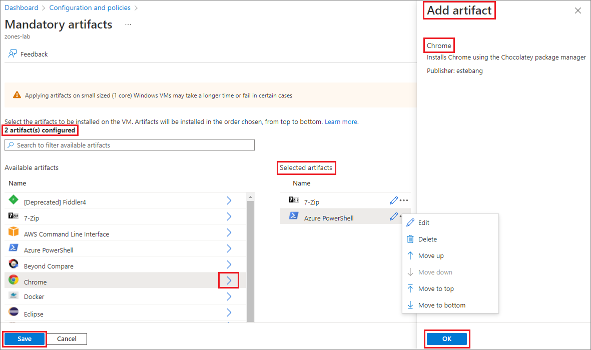
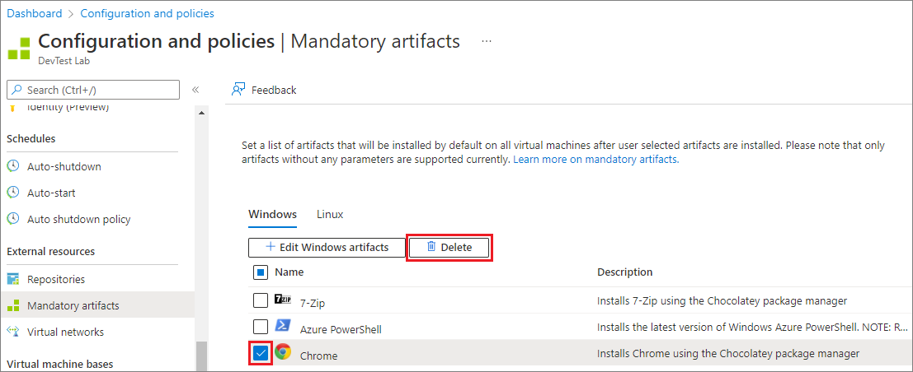
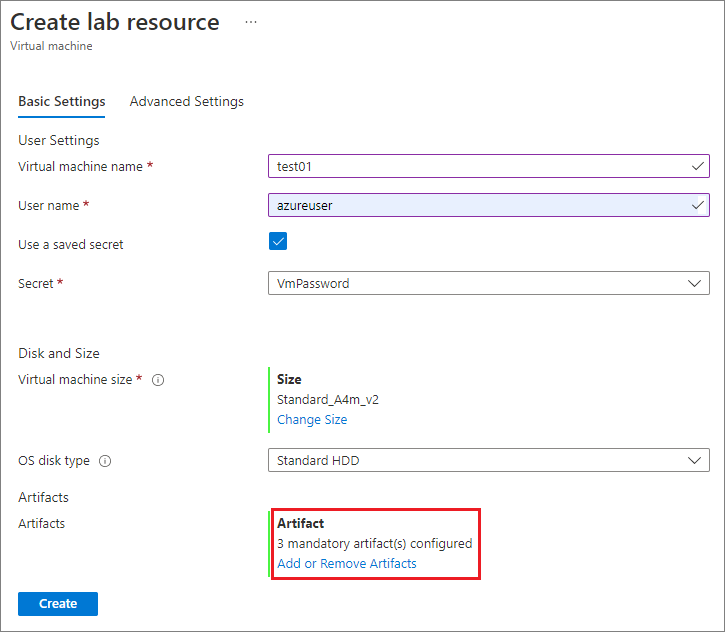
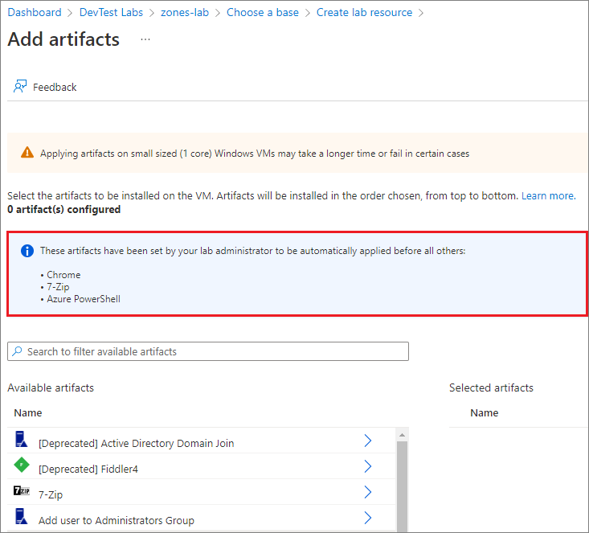

# Specify mandatory artifacts for DevTest Labs VMs

This article describes how to specify mandatory *artifacts* in Azure DevTest Labs to install on every lab virtual machine (VM). Artifacts are tools and applications to add to VMs. Installing mandatory artifacts ensures all lab VMs have standardized, up-to-date artifacts. Lab users don't have to spend time and effort to add needed artifacts individually.

Mandatory artifacts can include any software that every VM in your lab must have. If you create a custom image from a VM that has mandatory artifacts applied to it, and create new VMs from that image, those VMs also have the mandatory artifacts. Even if the custom image is old, VM creation applies the most updated versions of the mandatory artifacts.
 
Only artifacts that have no parameters can be mandatory artifacts. Lab users don't have to enter extra parameter values, making the VM creation process simple.

During VM creation, mandatory artifacts install before any artifacts the user chooses to install on the machine.

## Specify mandatory artifacts

You can select mandatory artifacts for Windows and Linux lab machines separately.

1. On your lab's home page, under **Settings** in the left navigation, select **Configuration and policies**.
1. On the **Configuration and policies** screen, under **External resources** in the left navigation, select **Mandatory artifacts**.
1. For Windows VMs, select **Windows**, and then select **Edit Windows artifacts**. For Linux VMs, select **Linux**, and then select **Edit Linux artifacts**.

   

1. On the **Mandatory artifacts** page, select the arrow next to each artifact you want to add to the VM.
1. On each **Add artifact** pane, select **OK**. The artifact appears under **Selected artifacts**, and the number of configured artifacts updates.

   

1. By default, artifacts install in the order you add them. To rearrange the order, select the ellipsis **...** next to the artifact in the **Selected artifacts** list, and select **Move up**, **Move down**, **Move to top**, or **Move to bottom**. To delete the artifact from the list, select **Delete**.

1. When you're done adding and arranging artifacts, select **Save**.

## Delete or rearrange mandatory artifacts

After you add mandatory artifacts, the lists of selected artifacts appear on the **Configuration and policies | Mandatory artifacts** screen under **Windows** and **Linux**. You can rearrange or delete the specified mandatory artifacts.

To delete a mandatory artifact from the list, select the checkbox next to the artifact, and then select **Delete**.

To rearrange the order of the mandatory artifacts:

1. Select **Edit Windows artifacts** or **Edit Linux artifacts**.
1. On the **Mandatory artifacts** page, select the ellipsis **...** next to the artifact in the **Selected artifacts** list.
1. Select **Move up**, **Move down**, **Move to top**, or **Move to bottom**.
1. Select **Save**.

## See mandatory artifacts for a VM

Once you specify mandatory artifacts for a lab, all lab VMs for that operating system (Windows or Linux) have those artifacts installed at creation. Lab users can see the mandatory artifacts to be installed on their VMs.

For example, to see the mandatory artifacts specified for lab Windows VMs in the earlier procedure:

1. On your lab's home page, select **Add**.
1. On the **Choose a base** page, select a Windows image, such as **Windows 11 Pro**.
1. On the **Create lab resource** page, under **Artifacts**, note the number of mandatory artifacts. To see what the mandatory artifacts are, select **Add or Remove Artifacts**.

   

1. On the **Add artifacts** screen, an informational message lists the mandatory artifacts to be installed, in order.

   

You can't remove, rearrange, or change mandatory artifacts when you create an individual VM. However, you can add other available artifacts to the VM. For more information and instructions, see [Add artifacts to DevTest Labs VMs](add-artifact-vm.md).

You can also create your own artifacts for VMs. For more information, see [Create custom artifacts for DevTest Labs VMs](devtest-lab-artifact-author.md).

## Next steps

- Learn how to [add a Git artifact repository to a lab](add-artifact-repository.md).
