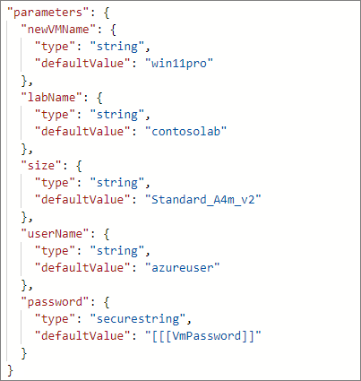
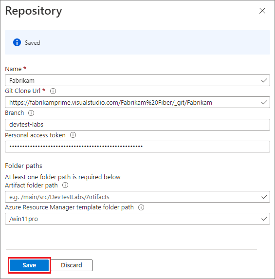

# Use ARM templates to create DevTest Labs virtual machines

You can use Azure Resource Manager (ARM) templates to create preconfigured Azure virtual machines (VMs) in Azure DevTest Labs. 

[!INCLUDE [About Azure Resource Manager](../../includes/resource-manager-quickstart-introduction.md)]

Single-VM ARM templates use the [Microsoft.DevTestLab/labs/virtualmachines](/azure/templates/microsoft.devtestlab/2018-09-15/labs/virtualmachines) resource type. Each VM created with this resource type appears as a separate item in the lab's **My virtual machines** list.

You can create your own single-VM ARM templates, access the public [DevTest Labs GitHub repository](https://github.com/Azure/azure-devtestlab) for preconfigured templates, or modify existing ARM templates to meet your needs. Lab users can use your ARM templates to create and deploy Azure VMs.

This article describes how to:

- View, edit, and save ARM templates for Azure VMs.
- Store ARM templates in source control repositories.
- Connect ARM template repositories to Azure DevTest Labs so lab users can access the templates.

## View, edit, and save ARM templates for VMs

You can customize and use an ARM template from any Azure VM base to deploy more of the same VM type in DevTest Labs.

1. On your lab's **Overview** page, select **Add** on the top toolbar.
1. On the **Choose a base** page, select the type of VM you want.
1. On the **Create lab resource** page, configure settings and add desired artifacts to your template VM.
1. On the **Advanced Settings** tab, select **View ARM template**.
1. Copy and [save the ARM template](#store-arm-templates-in-git-repositories) to use for creating more VMs.

   

1. If you want to create an instance of the VM now, on the **Basic Settings** tab, select **Create**.

### Set VM expiration date

For scenarios such as training, demos, and trials, you might want to delete VMs automatically after a certain date so they don't keep incurring costs. When you create a lab VM from the Azure portal, you can set an expiration date by specifying the **Expiration date** property on the **Advanced settings** tab. For an ARM template that defines the `expirationDate` property, see [Creates a new virtual machine in a Lab with a specified expiration date](https://github.com/Azure/azure-devtestlab/tree/master/samples/DevTestLabs/QuickStartTemplates/101-dtl-create-vm-username-pwd-customimage-with-expiration).

<a name="configure-your-own-template-repositories"></a>
<a name="create-your-own-template-repositories"></a>
## Store ARM templates in Git repositories

As a best practice for infrastructure as code and configuration as code, store your ARM templates in source control. DevTest Labs can load your ARM templates directly from your GitHub or Azure Repos source control repository. You can then use the templates throughout your release cycle, from development through test to production environments.

Use the following file structure to store an ARM template in a source control repository:

- Name the main template file *azuredeploy.json*.

- To reuse the ARM template, you need to update the `parameters` section of *azuredeploy.json*. You can create a *parameter.json* file that customizes just the parameters, without having to edit the main template file. Name this parameter file *azuredeploy.parameters.json*.

  

  In the parameters file, you can use the parameters `_artifactsLocation` and `_artifactsLocationSasToken` to construct a `parametersLink` URI value for automatically managing nested templates. For more information about nested templates, see [Deploy nested Azure Resource Manager templates for testing environments](deploy-nested-template-environments.md).

- You can define metadata that specifies the template display name and description in a file named *metadata.json*.

  ```json
  {
    "itemDisplayName": "<template name>",
    "description": "<template description>"
  }
  ```

The following screenshot shows a typical ARM template folder structure in a repository.


## Add template repositories to labs

Add your template repositories to your lab so all lab users can access the templates.

1. On the lab's **Overview** page, select **Configuration and policies** from the left navigation.

1. On the **Configuration and policies** page, select **Repositories** under **External resources** in the left navigation.

   On the **Repositories** screen, the **Public Artifact Repo** and **Public Environment Repo** are automatically present for all labs, and connect to the [DevTest Labs public GitHub repository](https://github.com/Azure/azure-devtestlab). If these repos aren't enabled for your lab, you can enable them by selecting the checkboxes next to **Public Artifact Repo** and **Public Environment Repo**, and then selecting **Enable** on the top menu bar. For more information, see [Enable and configure public environments](devtest-lab-create-environment-from-arm.md#enable-and-configure-public-environments).

1. To add your private ARM template repository to the lab, select **Add** in the top menu bar.

   

1. In the **Repositories** pane, enter the following information:

   - **Name**: Enter a repository name to use in the lab.
   - **Git clone URL**: Enter the Git HTTPS clone URL from GitHub or Azure Repos.
   - **Branch** (optional): Enter the branch that has your ARM template definitions.
   - **Personal access token**: Enter the personal access token to securely access your repository.
     - To get a token from Azure Repos, select **User settings** > **Personal access tokens**.
     - To get your token from GitHub, under your profile, select **Settings** > **Developer settings** > **Personal access tokens**.
   - **Folder paths**: Enter the folder for your ARM template definitions, relative to the Git clone URI.

1. Select **Save**.

   

The repository now appears in the **Repositories** list for the lab. Users can now use the repository templates to [create multi-VM DevTest Labs environments](devtest-lab-create-environment-from-arm.md). Lab administrators can use the templates to [automate lab deployment and management tasks](devtest-lab-use-arm-and-powershell-for-lab-resources.md#arm-template-automation).

### Next steps

- [Best practices for creating Azure Resource Manager templates](../azure-resource-manager/templates/best-practices.md)
- [Add a Git repository to store custom artifacts and Resource Manager templates](devtest-lab-add-artifact-repo.md)
- [Use ARM templates to create DevTest Labs environments](devtest-lab-create-environment-from-arm.md)
- [ARM quickstart templates for DevTest Labs automation](https://github.com/Azure/azure-quickstart-templates)
