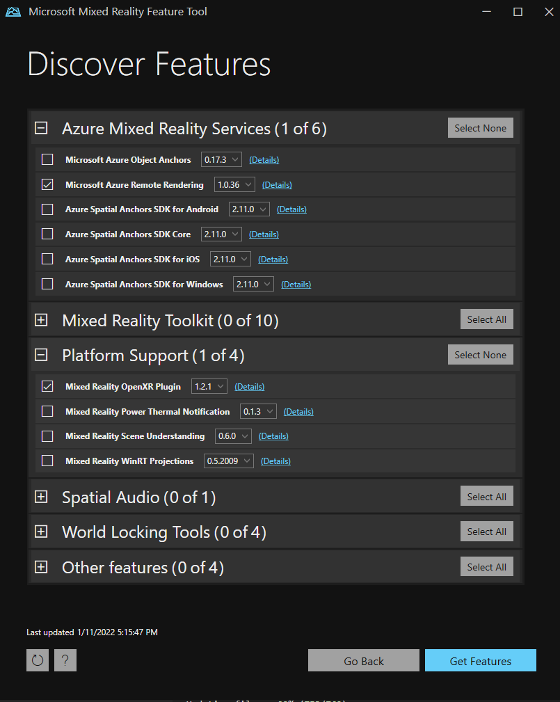

# Install the Remote Rendering package for Unity

Azure Remote Rendering uses a Unity package to encapsulate the integration into Unity.
This package contains the entire C# API and all plugin binaries required to use Azure Remote Rendering with Unity.
Following Unity's naming scheme for packages, the package is called **com.microsoft.azure.remote-rendering**.

The package is not part of the [ARR samples repository](https://github.com/Azure/azure-remote-rendering), and it is not available from Unity's internal package registry.
You can choose one of the following options to install the Unity package.

## Install Remote Rendering package using the Mixed Reality Feature Tool

The [Mixed Reality Feature Tool](/windows/mixed-reality/develop/unity/welcome-to-mr-feature-tool) ([download](https://aka.ms/mrfeaturetool)) integrates Mixed Reality feature packages into Unity projects.

To add the package to a project, you need to:

1. [Download the Mixed Reality Feature Tool](https://aka.ms/mrfeaturetool)
1. Follow the [full instructions](/windows/mixed-reality/develop/unity/welcome-to-mr-feature-tool) on how to use the tool.
1. On the **Discover Features** page, tick the box for the **Microsoft Azure Remote Rendering** package under **Azure Mixed Reality Services** and select the version of the package you wish to add to your project
1. If you want to use OpenXR, also add the **Mixed Reality OpenXR Plugin** package under **Azure Mixed Reality Services** in the same way.



To update your local package, just select a newer version from the Mixed Reality Feature Tool and install it. Updating the package may occasionally lead to console errors. If you see errors in the console, try closing and reopening the project.

## Install Remote Rendering package manually

To install the Remote Rendering package manually, you need to:

1. Download the package from the Mixed Reality Packages NPM feed at `https://pkgs.dev.azure.com/aipmr/MixedReality-Unity-Packages/_packaging/Unity-packages/npm/registry`.
    * You can either use [NPM](https://www.npmjs.com/get-npm) and run the following command to download the package to the current folder.

      ```cmd
      npm pack com.microsoft.azure.remote-rendering --registry https://pkgs.dev.azure.com/aipmr/MixedReality-Unity-Packages/_packaging/Unity-packages/npm/registry
      ```

      If you want to use OpenXR, run the following command to download the platform support package to the current folder.

      ```cmd
      npm pack com.microsoft.mixedreality.openxr --registry https://pkgs.dev.azure.com/aipmr/MixedReality-Unity-Packages/_packaging/Unity-packages/npm/registry
      ```

    * Or you can use the PowerShell script at `Scripts/DownloadUnityPackages.ps1` from the [azure-remote-rendering GitHub repository](https://github.com/Azure/azure-remote-rendering).
        * Edit the contents of `Scripts/unity_sample_dependencies.json` to

          ```json
          {
            "packages": [
              {
                "name": "com.microsoft.azure.remote-rendering", 
                "version": "latest", 
                "registry": "https://pkgs.dev.azure.com/aipmr/MixedReality-Unity-Packages/_packaging/Unity-packages/npm/registry"
              }
            ]
          }
          ```

          If you want to use OpenXR, you also need the platform support package. Edit the contents of `Scripts/unity_sample_dependencies.json` to

          ```json
          {
            "packages": [
              {
                "name": "com.microsoft.azure.remote-rendering", 
                "version": "latest", 
                "registry": "https://pkgs.dev.azure.com/aipmr/MixedReality-Unity-Packages/_packaging/Unity-packages/npm/registry"
              },
              {
                "name": "com.microsoft.mixedreality.openxr", 
                "version": "latest", 
                "registry": "https://pkgs.dev.azure.com/aipmr/MixedReality-Unity-Packages/_packaging/Unity-packages/npm/registry"
              }
            ]
          }
          ```

        * Run the following command in PowerShell to download the package to the provided destination directory.

          ```PowerShell
          DownloadUnityPackages.ps1 -DownloadDestDir <destination directory>
          ```

1. [Install the downloaded package(s)](https://docs.unity3d.com/Manual/upm-ui-tarball.html) with Unity's Package Manager.

To update a local package, just repeat the respective download steps you used and reimport the package. Updating the package may occasionally lead to console errors. If you see errors in the console, try closing and reopening the project.

## Unity render pipelines

Remote Rendering works with both the **:::no-loc text="Universal render pipeline":::** and the **:::no-loc text="Standard render pipeline":::**. For performance reasons, the Universal render pipeline is recommended.

To use the **:::no-loc text="Universal render pipeline":::**, its package has to be installed in Unity. The installation can either be done in Unity's **Package Manager** UI (package name **Universal RP**, version 7.3.1 or newer), or through the `Packages/manifest.json` file, as described in the [Unity project setup tutorial](../../tutorials/unity/view-remote-models/view-remote-models.md#include-the-azure-remote-rendering-and-openxr-packages).

## Next steps

* [Unity game objects and components](objects-components.md)
* [Tutorial: View Remote Models](../../tutorials/unity/view-remote-models/view-remote-models.md)
